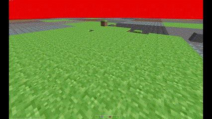

# JAMC
Just another Minecraft clone.

This project is terrible. I developed this while knowing nothing about game dev, about LWJGL3, geometry and who knows what else.
I spent a lot of time trying to make things work, but the result is barely functional. Furthermore, I would say that I learned a lot from this project, but no, I barely remember anything about it after just a few years. However, I do remember the frustration I felt in trying to fix things.

Well, anyway, the features are:

- Movement, which sometimes doesn't work
- Jumping, which is way too fast (maybe it's based on the FPS, was I that stupid?)
- Building, that sometimes doesn't work
- Breaking (this actually works)

## Technologies used

- LWJGL3
- Java with gradle

## Example

